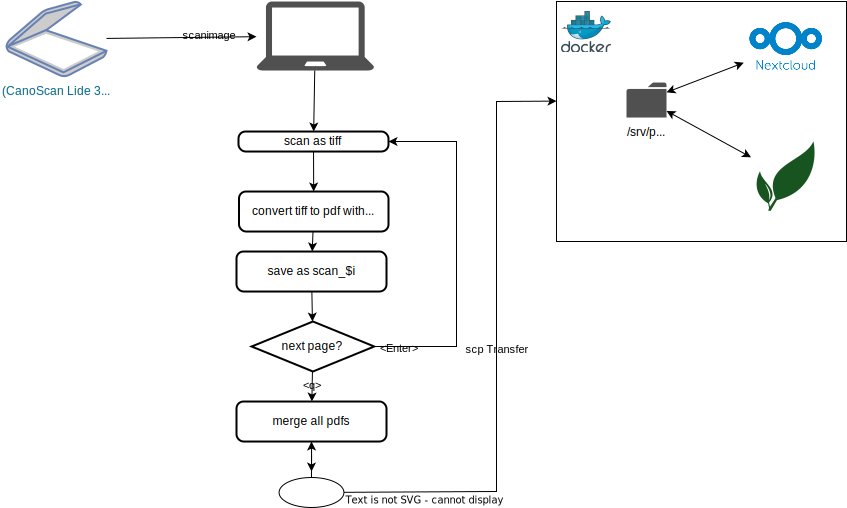

# PaperlessOfficeGoBrrrr
a repository for storing all scripts and relevant informations about my private paperless office

## required hardware & software

### local
- Scanner (e.g. Canon ScanLide 300)
- scanimage
- ocrmypdf
- pdfunite
- scp

### remote
- paperless ngx
- optional: a nextcloud instance with enabled external storage
  

## process

[Alt text](./Diagram.drawio.svg)

